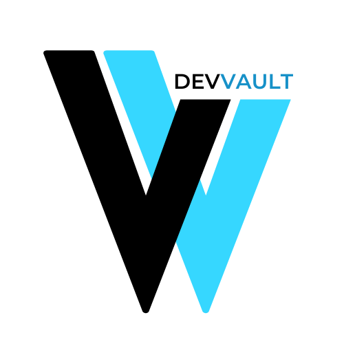

# DevVault Server

[](https://devvaultproject.netlify.app)  
**[¡Mira la App!](https://devvaultproject.netlify.app)**

---

## Server Structure

### Collections

#### **technologies**

La colección `technologies` contiene la siguiente estructura:  
```json
{
  "id": Number,
  "name": String,
  "foundedIn": Number,
  "inventedBy": String,
  "category": String,
  "description": String
}
```
#### **flipCards**

La colección `flipCards` contiene la siguiente estructura:  
```json
{
  "id": Number,
  "title": String,
  "resume": String,
  "description": String,
  "officialDoc": String,
  "technologyId": Number,
  "imgUrl": String,
  "flipCount": Number
}
```

## Client Routes

| **Método** | **Endpoint**                                  | **Respuesta (200)**                 | **Acción**                                                                 |
|------------|-----------------------------------------------|-------------------------------------|-----------------------------------------------------------------------------|
| GET        | `/technologies`                               | `[technologies]`                    | Obtiene la lista de todas las tecnologías disponibles.                     |
| GET        | `/flipCards`                                  | `[flipCards]`                       | Obtiene todos los flipCards.                                               |
| GET        | `/flipCards/:flipCardId`                      | `{ flipCard }`                      | Obtiene un flipCard específico.                                            |
| POST       | `/flipCards`                                  | `{ nuevo flipCard }`                | Crea un nuevo flipCard.                                                    |
| PUT        | `/flipCards/:flipCardId`                      | `{ actualiza flipCard }`            | Actualiza un flipCard específico, mediante su ID.                          |
| PATCH      | `/flipCards/:flipCardId`                      | `{ actualiza propiedad }`           | Actualiza una propiedad específica de un flipCard existente, mediante ID.  |
| DELETE     | `/flipCards/:flipCardId`                      | `{}`                                | Elimina un flipCard específico, mediante ID.                               |
| GET        | `/technologies/:technologyId?_embed=flipCards`| `{ tecnología, [flipCards] }`       | Obtiene una tecnología específica y todos sus flipCards correspondientes.  |
| GET        | `/flipCards/:flipCardId?_expand=technology`   | `{ flipCard, tecnología }`          | Obtiene un flipCard específico y la tecnología correspondiente.            |
| GET        | `/technologies/category/:category`            | `[technologies]`                    | Busca tecnologías filtradas por categoría.                                 |

---

## Links

- [Deploy de la App](https://devvaultproject.netlify.app)
- [Repositorio del Cliente](https://github.com/HelixGuardi/dev-vault-client)
- [Repositorio del Servidor](https://github.com/HelixGuardi/dev-vault-server)
<!-- - [Documentación de la API](https://github.com/usuario/devvault-api-docs) -->